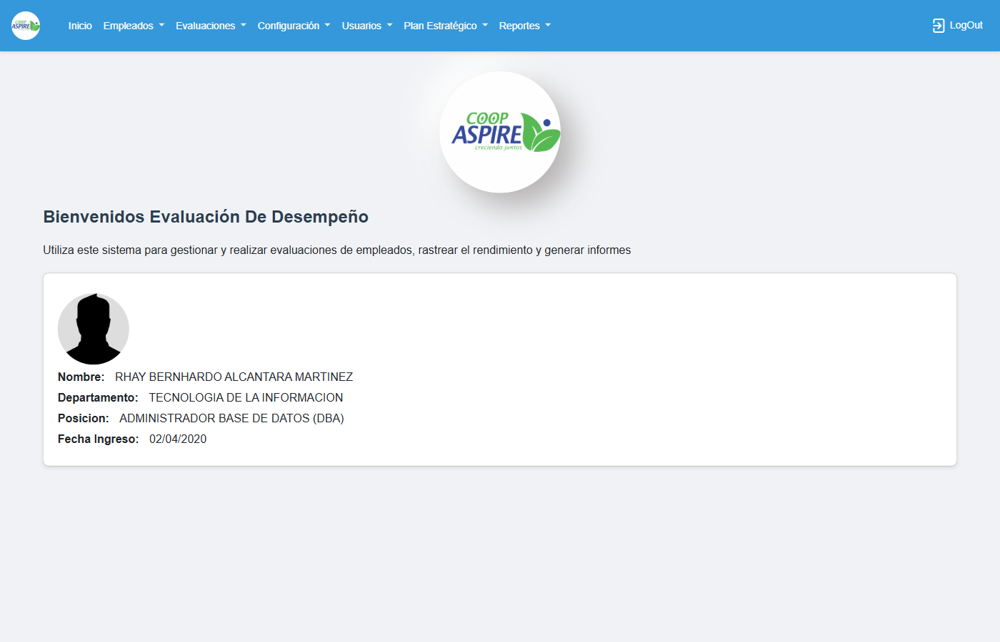
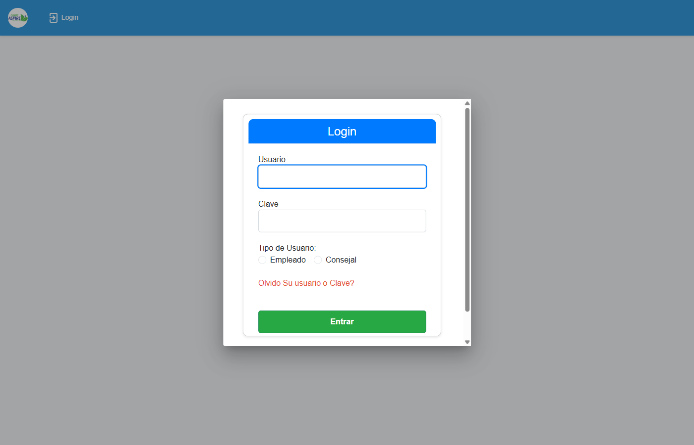
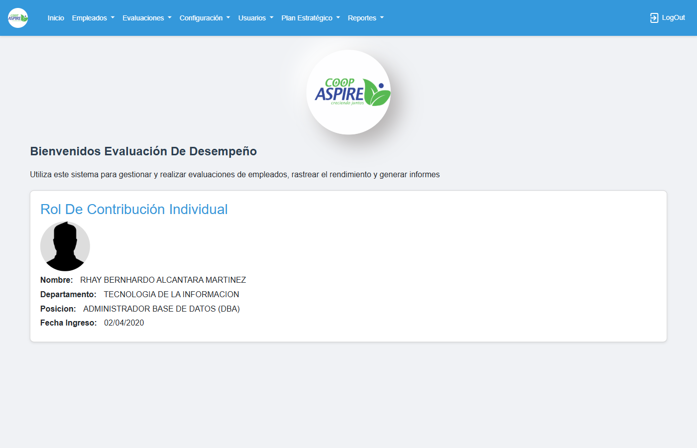
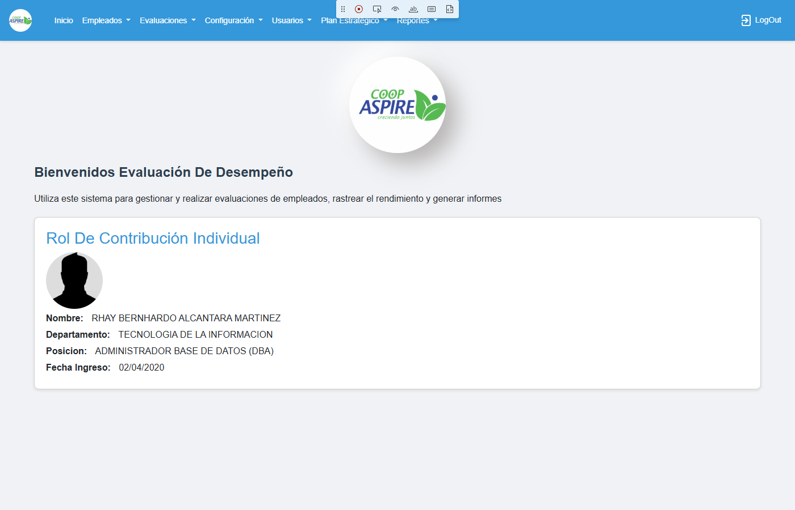

# Issues — Evaluación Medio Año 2026

**Fecha:** 5/6/2026
**Ambiente:** http://192.168.7.222/evaluacionempleado-prueba
**DB:** Evaluaciones_Test

---

## Issues detectados (9)

### 1. [UI] Botón "Agregar" no visible en /Periodo

### 2. [Formulario] Campo #descripcion no encontrado en el formulario

### 3. [Formulario] Campo #fechaInicio no encontrado

### 4. [Formulario] Campo #fechaFin no encontrado

### 5. [Formulario] Select #tipo no encontrado — no se pudo seleccionar medio_ano

### 6. [UI] Botón Guardar no encontrado en el formulario

### 7. [Datos] El nuevo período NO aparece en la lista después de guardar

### 8. [UI] Botón "Cambiar Estado" no encontrado en /evaluation-periods

### 9. [Datos] Lista de evaluaciones vacía — no se generaron evaluaciones para Medio Año 2026

---

## Capturas en orden

- 
- 
- 
- 
- 
- 
- 
- 
- 
- 
- 
- 
- 
- 
- 
- 
- 
- 
- 
- 
- 
- 