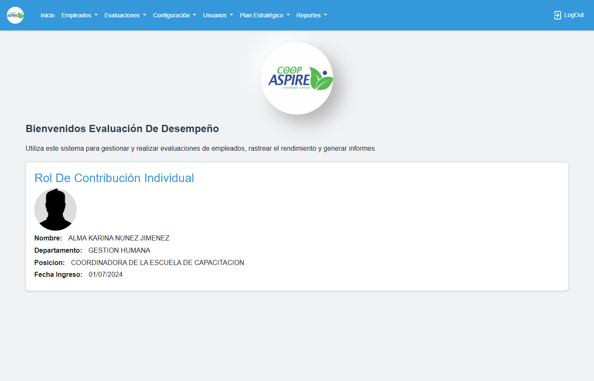
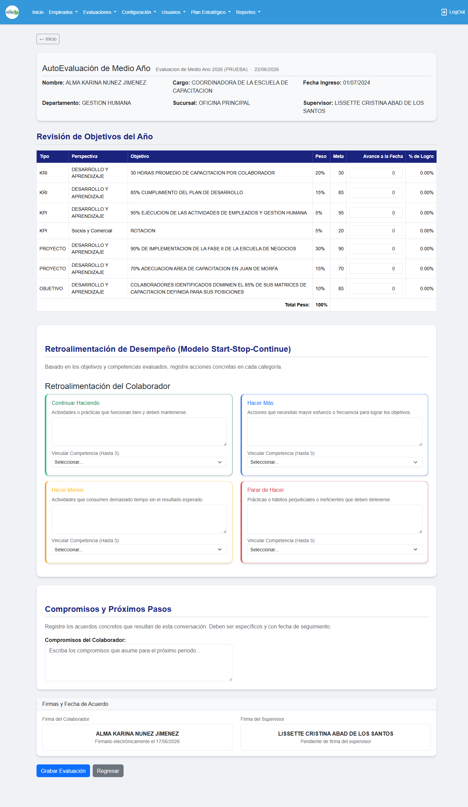
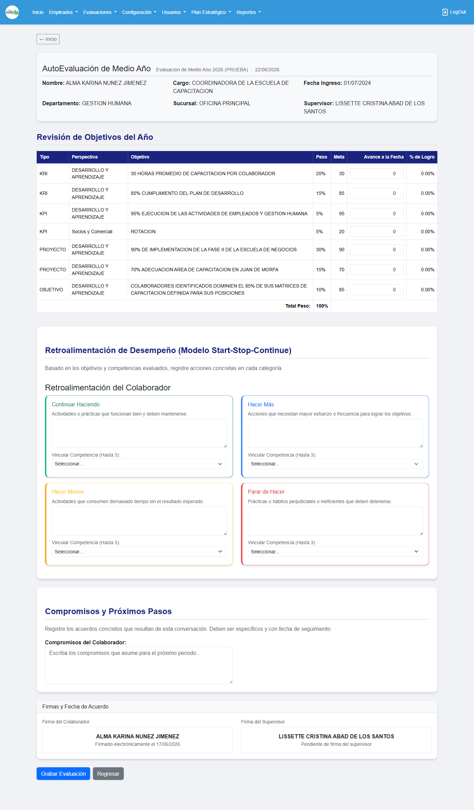

# Verificación — Tipo como columna (Medio Año)

**Ambiente:** http://192.168.7.222/evaluacionempleado-prueba
**DB:** evaluacion_test (período medio año Id 8)
**Usuario prueba:** ANUNEZ

## Resultados

- ✅ Login completado
- ✅ "Tipo" es la primera columna del encabezado
- ✅ Sin banda agrupadora vieja (tipo-header-row eliminada)
- ✅ Columna Tipo poblada con: KRI, KPI, PROYECTO, OBJETIVO
- ✅ Sin errores JS en consola

## Capturas

- 
- 
- 